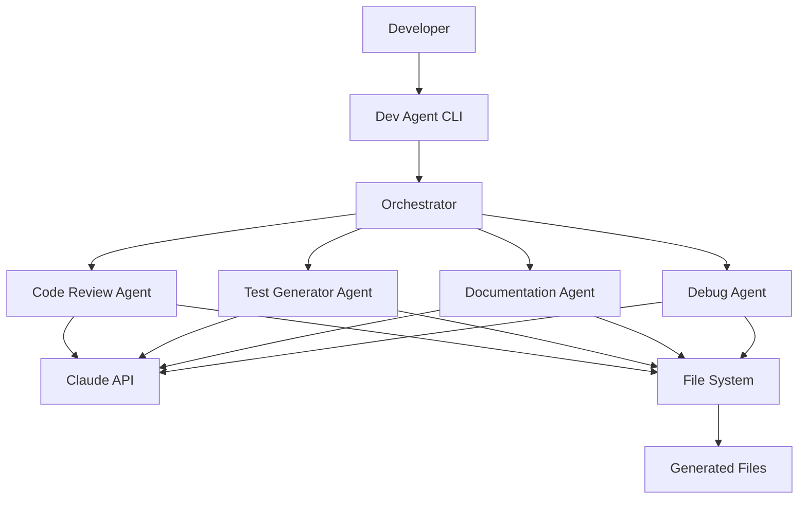

# 🤖 Development Multi-Agent System

> AI-powered development assistants to accelerate Duulair platform development

**Version:** 1.0.0
**Last Updated:** 2024-01-16

---

## 📋 Overview

Development Multi-Agent System คือชุดของ AI agents ที่ออกแบบมาเพื่อช่วยนักพัฒนาในการสร้าง platform โดยใช้ Claude AI เพื่อทำงานต่างๆ อัตโนมัติ เช่น code review, test generation, documentation, และ debugging

### ✨ Features

- 🔍 **Code Review** - ตรวจสอบคุณภาพโค้ด security และ performance
- 🧪 **Test Generation** - สร้าง unit tests และ integration tests อัตโนมัติ
- 📚 **Documentation** - สร้าง JSDoc, README, API docs และ architecture diagrams
- 🐛 **Debugging** - วิเคราะห์และแก้ไข bugs พร้อมแนะนำวิธีแก้

---

## 🏗️ Architecture



---

## 🚀 Quick Start

### Installation

Dependencies อยู่ใน `package.json` แล้ว แต่ถ้ายังไม่ได้ลง:

```bash
npm install commander glob
```

### Setup

1. ตรวจสอบว่ามี `ANTHROPIC_API_KEY` ใน `.env`:
```env
ANTHROPIC_API_KEY=sk-ant-your_api_key_here
```

2. Build TypeScript (optional):
```bash
npm run build
```

### Basic Usage

```bash
# Code review
npm run dev-agent review src/agents/specialized/HealthAgent.ts

# Generate tests
npm run dev-agent test src/agents/specialized/HealthAgent.ts

# Generate documentation
npm run dev-agent doc src/agents/specialized/HealthAgent.ts --jsdoc

# Debug
npm run dev-agent debug src/agents/specialized/HealthAgent.ts --error "TypeError: ..."
```

---

## 📖 Agents Guide

### 1. 🔍 Code Review Agent

**Purpose:** ตรวจสอบคุณภาพโค้ด ความปลอดภัย และ performance

**Capabilities:**
- Code quality analysis
- Security vulnerability detection
- Performance bottleneck identification
- Best practices validation
- Code smell detection

**Usage:**

```bash
# Basic review
npm run dev-agent review src/agents/specialized/HealthAgent.ts

# Security-focused review
npm run dev-agent review src/services/supabase.service.ts --security

# Performance-focused review
npm run dev-agent review src/agents/core/OrchestratorAgent.ts --performance

# Strict mode (report minor issues)
npm run dev-agent review src/agents/specialized/AlertAgent.ts --strict

# Review multiple files
npm run dev-agent review-all "src/agents/**/*.ts" --output review-report.md
```

**Output Example:**

```markdown
# Code Review Report

## Score: 85/100

## Summary
Code is well-structured with good type safety. Minor improvements needed in error handling.

## Strengths
✓ Strong type definitions
✓ Clear function names
✓ Good separation of concerns

## Issues (3)

1. 🟡 MEDIUM - Line 45
   - Category: error-handling
   - Issue: Missing try-catch block
   - Fix: Wrap async operation in try-catch

2. 🟢 LOW - Line 120
   - Category: style
   - Issue: Long function (50+ lines)
   - Fix: Consider breaking into smaller functions
```

**Options:**
- `--strict` - Report even minor style issues
- `--security` - Focus heavily on security
- `--performance` - Focus on performance optimization
- `--output <file>` - Save report to file

---

### 2. 🧪 Test Generator Agent

**Purpose:** สร้าง unit tests และ integration tests อัตโนมัติ

**Capabilities:**
- Jest unit test generation
- Integration test generation
- Mock data and service generation
- Edge case identification
- AAA pattern (Arrange-Act-Assert)

**Usage:**

```bash
# Generate unit tests
npm run dev-agent test src/agents/specialized/HealthAgent.ts

# Generate integration tests
npm run dev-agent test src/agents/specialized/HealthAgent.ts --integration

# Include mocks
npm run dev-agent test src/services/supabase.service.ts --mock

# Generate tests for all files in directory
npm run dev-agent test-all src/agents/specialized --pattern "**/*.ts"
```

**Generated Test Example:**

```typescript
// src/agents/specialized/HealthAgent.test.ts
import { HealthAgent } from './HealthAgent';

describe('HealthAgent', () => {
  let agent: HealthAgent;

  beforeEach(() => {
    agent = new HealthAgent();
  });

  describe('process', () => {
    it('should log medication when user reports taking medicine', async () => {
      // Arrange
      const message = {
        id: '123',
        content: 'กินยาแล้วค่ะ',
        context: {
          userId: 'U123',
          timestamp: new Date()
        }
      };

      // Act
      const result = await agent.process(message);

      // Assert
      expect(result.success).toBe(true);
      expect(result.data.taskType).toBe('medication');
    });

    it('should handle invalid blood pressure values', async () => {
      // Test edge case
      const message = {
        id: '124',
        content: 'วัดความดันได้ 999/999',
        context: { userId: 'U123', timestamp: new Date() }
      };

      const result = await agent.process(message);

      expect(result.success).toBe(false);
      expect(result.errors).toContain('Invalid blood pressure values');
    });
  });
});
```

**Options:**
- `--integration` - Generate integration tests
- `--mock` - Include mock setup
- `--pattern <pattern>` - File pattern for batch generation

---

### 3. 📚 Documentation Agent

**Purpose:** สร้างและอัปเดต documentation ต่างๆ

**Capabilities:**
- JSDoc comment generation
- README.md generation
- API documentation
- Architecture diagrams (Mermaid)
- Auto-update existing docs

**Usage:**

```bash
# Add JSDoc comments
npm run dev-agent doc src/agents/specialized/HealthAgent.ts --jsdoc

# Generate README for project
npm run dev-agent doc . --readme

# Generate API documentation
npm run dev-agent doc src/services/supabase.service.ts --api

# Generate architecture diagrams
npm run dev-agent doc . --architecture
```

**JSDoc Example:**

```typescript
/**
 * Health Agent - Processes health-related data and logs to database
 *
 * This agent handles:
 * - Medication logging
 * - Vital signs recording (BP, heart rate, blood sugar)
 * - Water intake tracking
 * - Activity logging
 *
 * @example
 * const agent = new HealthAgent();
 * const result = await agent.process({
 *   content: 'วัดความดัน 120/80',
 *   context: { userId: 'U123' }
 * });
 */
export class HealthAgent extends BaseAgent {
  /**
   * Process health-related messages
   *
   * @param message - The message from user containing health data
   * @returns Processing result with logged data
   * @throws {ValidationError} When health data is invalid
   */
  async process(message: Message): Promise<AgentResult> {
    // Implementation
  }
}
```

**Options:**
- `--jsdoc` - Add JSDoc comments
- `--readme` - Generate README.md
- `--api` - Generate API docs
- `--architecture` - Generate diagrams

---

### 4. 🐛 Debug Agent

**Purpose:** ช่วยวิเคราะห์และแก้ไข bugs

**Capabilities:**
- Error message analysis
- Root cause identification
- Fix suggestion with code
- Performance analysis
- Log file analysis

**Usage:**

```bash
# Analyze error
npm run dev-agent debug src/agents/specialized/HealthAgent.ts \
  --error "TypeError: Cannot read property 'map' of undefined"

# With stack trace
npm run dev-agent debug src/services/supabase.service.ts \
  --error "Connection timeout" \
  --stack "at SupabaseService.query (line 45)"

# Performance analysis
npm run dev-agent debug src/agents/core/OrchestratorAgent.ts --performance

# Analyze logs
npm run dev-agent debug logs/app.log --logs

# Save report
npm run dev-agent debug src/agents/specialized/AlertAgent.ts \
  --error "..." --output debug-report.md
```

**Debug Report Example:**

```markdown
# 🐛 Debug Report

**File:** src/agents/specialized/HealthAgent.ts
**Error:** TypeError: Cannot read property 'map' of undefined

## Root Cause

The `vitals` array is undefined when user doesn't have any previous vital records. The code attempts to call `.map()` on undefined.

## Affected Lines
- Line 67: `vitals.map(v => v.systolic)`

## Fix

### Description
Add null check before accessing array methods

### Steps
1. Check if `vitals` exists and is an array
2. Provide default empty array if undefined
3. Add type guard

### Code
\`\`\`typescript
// Before
const systolicValues = vitals.map(v => v.systolic);

// After
const systolicValues = (vitals || []).map(v => v.systolic);

// Or with type guard
if (!Array.isArray(vitals)) {
  vitals = [];
}
const systolicValues = vitals.map(v => v.systolic);
\`\`\`

## Prevention Tips
- Always check if array exists before using array methods
- Use optional chaining: `vitals?.map()`
- Set default values in function parameters
- Add TypeScript non-null assertion carefully
```

**Options:**
- `--error <message>` - Error message to analyze
- `--stack <trace>` - Stack trace
- `--performance` - Performance analysis
- `--logs` - Analyze as log file
- `--output <file>` - Save report

---

## 🎯 Usage Patterns

### Pattern 1: Complete Feature Development Workflow

```bash
# 1. Review existing code before starting
npm run dev-agent review src/agents/specialized/HealthAgent.ts --strict

# 2. Make changes to code
# ... (edit HealthAgent.ts)

# 3. Generate tests
npm run dev-agent test src/agents/specialized/HealthAgent.ts --mock

# 4. Add documentation
npm run dev-agent doc src/agents/specialized/HealthAgent.ts --jsdoc

# 5. Review again
npm run dev-agent review src/agents/specialized/HealthAgent.ts

# 6. Run tests
npm test
```

### Pattern 2: Bug Fixing Workflow

```bash
# 1. Analyze the error
npm run dev-agent debug src/services/supabase.service.ts \
  --error "Connection failed" \
  --output debug-report.md

# 2. Review debug report
cat debug-report.md

# 3. Apply fix suggestions
# ... (edit code)

# 4. Verify with tests
npm run dev-agent test src/services/supabase.service.ts

# 5. Run tests
npm test

# 6. Review fixed code
npm run dev-agent review src/services/supabase.service.ts
```

### Pattern 3: Batch Processing

```bash
# Review all agent files
npm run dev-agent review-all "src/agents/**/*.ts" --output agents-review.md

# Generate tests for all services
npm run dev-agent test-all src/services

# Check review report
cat agents-review.md
```

### Pattern 4: Interactive Mode

```bash
# Start interactive mode
npm run dev-agent interactive

# Then use @ commands:
dev-agent> @review src/agents/specialized/HealthAgent.ts
dev-agent> @test src/services/supabase.service.ts
dev-agent> @doc src/agents/core/BaseAgent.ts
dev-agent> @debug src/index.ts
dev-agent> exit
```

---

## ⚙️ Configuration

### Environment Variables

```env
# Required
ANTHROPIC_API_KEY=sk-ant-your_api_key_here

# Optional
DEV_AGENT_MODEL=claude-3-5-sonnet-20241022
DEV_AGENT_TEMPERATURE=0.3
DEV_AGENT_MAX_TOKENS=4000
```

### Custom Scripts in package.json

Add to your `package.json`:

```json
{
  "scripts": {
    "dev-agent": "ts-node src/agents/development/DevAgentCLI.ts",
    "review": "npm run dev-agent review",
    "test:gen": "npm run dev-agent test",
    "doc:gen": "npm run dev-agent doc",
    "debug:agent": "npm run dev-agent debug"
  }
}
```

---

## 📊 Output Examples

### Code Review Report

```
📊 Score: 85/100

📝 Summary: Well-structured code with strong type safety. Minor improvements in error handling needed.

💚 Strengths:
   ✓ Comprehensive type definitions
   ✓ Clear separation of concerns
   ✓ Good use of async/await

⚠️  Issues (3):

1. 🟡 MEDIUM - Line 45
   Category: error-handling
   Issue: Missing try-catch for async operation
   Fix: Wrap Supabase query in try-catch block

2. 🟢 LOW - Line 120
   Category: style
   Issue: Function exceeds 50 lines
   Fix: Extract helper functions

3. 🟢 LOW - Line 200
   Category: performance
   Issue: Inefficient array iteration
   Fix: Use Array.filter() instead of multiple loops

💡 Suggestions:
   - Add input validation for user data
   - Consider caching frequent database queries
   - Add JSDoc comments for public methods
```

---

## 🔧 Advanced Usage

### Custom Agent Configuration

```typescript
import { CodeReviewAgent } from './agents/development/CodeReviewAgent';

const customReviewAgent = new CodeReviewAgent();

// Custom review with specific focus
const result = await customReviewAgent.process({
  id: 'custom-1',
  command: 'review',
  target: 'src/agents/specialized/HealthAgent.ts',
  context: {
    options: {
      type: 'security',
      strict: true,
      focusAreas: ['authentication', 'data-validation', 'sql-injection']
    },
    timestamp: new Date()
  }
});
```

### Programmatic API

```typescript
import { TestGeneratorAgent } from './agents/development/TestGeneratorAgent';

const testAgent = new TestGeneratorAgent();

// Generate tests for multiple files
const files = [
  'src/agents/specialized/HealthAgent.ts',
  'src/agents/specialized/AlertAgent.ts',
  'src/agents/specialized/ReportAgent.ts'
];

for (const file of files) {
  const result = await testAgent.process({
    id: '',
    command: 'test',
    target: file,
    context: {
      options: { type: 'unit', mock: true },
      timestamp: new Date()
    }
  });

  console.log(`Generated: ${result.data.testFile}`);
}
```

---

## 🎓 Best Practices

### 1. Run Reviews Before Committing

```bash
# In pre-commit hook
npm run dev-agent review-all "src/**/*.ts" --output .review-report.md
```

### 2. Generate Tests Immediately After Writing Code

```bash
# After creating new agent
npm run dev-agent test src/agents/specialized/NewAgent.ts --mock
```

### 3. Keep Documentation Updated

```bash
# When changing public APIs
npm run dev-agent doc src/services/supabase.service.ts --api
```

### 4. Use Debug Agent for Production Issues

```bash
# When investigating production error
npm run dev-agent debug src/agents/core/OrchestratorAgent.ts \
  --error "Production error message" \
  --stack "Stack trace from logs" \
  --output incident-analysis.md
```

---

## 🚧 Troubleshooting

### Issue: "ANTHROPIC_API_KEY not found"

**Solution:**
```bash
# Check .env file
cat .env | grep ANTHROPIC_API_KEY

# If missing, add it
echo "ANTHROPIC_API_KEY=sk-ant-your_key" >> .env
```

### Issue: "Cannot find module 'commander'"

**Solution:**
```bash
npm install commander glob
```

### Issue: "Permission denied"

**Solution:**
```bash
# Make CLI executable
chmod +x src/agents/development/DevAgentCLI.ts
```

### Issue: Generated code has syntax errors

**Solution:**
- Review and manually adjust generated code
- Use `--strict` mode for better quality
- Provide more context in commands

---

## 📈 Roadmap

### Phase 1 (Current)
- ✅ Code Review Agent
- ✅ Test Generator Agent
- ✅ Documentation Agent
- ✅ Debug Agent
- ✅ CLI Interface

### Phase 2 (Planned)
- [ ] Performance Profiler Agent
- [ ] Security Audit Agent
- [ ] Migration Generator Agent
- [ ] API Contract Validator Agent

### Phase 3 (Future)
- [ ] Visual Studio Code Extension
- [ ] CI/CD Integration
- [ ] Team Collaboration Features
- [ ] Custom Agent Templates

---

## 🤝 Contributing

Want to add new agents or improve existing ones?

1. Create new agent extending `BaseDevAgent`
2. Implement `process()` method
3. Add to CLI commands
4. Write tests
5. Update documentation

Example:

```typescript
import { BaseDevAgent, DevCommand, DevResult } from './BaseDevAgent';

export class MyCustomAgent extends BaseDevAgent {
  constructor() {
    super({
      name: 'my-agent',
      role: 'Does something cool',
      capabilities: ['feature-1', 'feature-2'],
      model: 'claude-3-5-sonnet-20241022'
    });
  }

  async process(command: DevCommand): Promise<DevResult> {
    // Your implementation
  }
}
```

---

## 📞 Support

- **Documentation:** `/docs/DEVELOPMENT_AGENTS.md`
- **Issues:** GitHub Issues
- **Examples:** `/examples/dev-agents/`

---

**Built with ❤️ using Claude AI**

**Last Updated:** 2024-01-16
**Version:** 1.0.0
