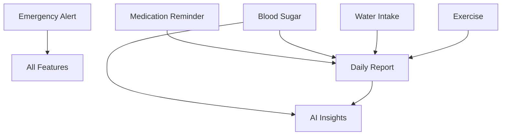

# 🗺️ Duulair Feature Roadmap

> Complete feature implementation roadmap with priorities and timelines

---

## 📊 Overview

Duulair is an elderly care platform powered by multi-agent AI system. This roadmap outlines all features from core functionality to advanced AI capabilities.

### Implementation Approach
**Use `/auto-dev` slash command to implement any spec automatically!**

```bash
/auto-dev docs/specs/medication-reminder.md
/auto-dev docs/specs/emergency-alert.md
# etc...
```

---

## 🎯 Feature Summary

| Feature | Priority | Effort | Status | Spec File |
|---------|----------|--------|--------|-----------|
| 🚨 Emergency Alert System | CRITICAL | 16h | 📋 Ready | [emergency-alert.md](specs/emergency-alert.md) |
| 💊 Medication Reminder | High | 20h | 📋 Ready | [medication-reminder.md](specs/medication-reminder.md) |
| 🩺 Blood Sugar Tracking | High | 8h | 📋 Ready | [blood-sugar-tracking.md](specs/blood-sugar-tracking.md) |
| 📊 Daily Health Report | High | 12h | 📋 Ready | [daily-health-report.md](specs/daily-health-report.md) |
| 🧠 AI Health Insights | High | 20h | 📋 Ready | [ai-health-insights.md](specs/ai-health-insights.md) |
| 💧 Water Intake Tracking | Medium | 6h | 📋 Ready | [water-intake-tracking.md](specs/water-intake-tracking.md) |
| 🏃 Exercise Tracking | Medium | 8h | 📋 Ready | [exercise-tracking.md](specs/exercise-tracking.md) |

**Total Estimated Effort**: ~90 hours (~11 days)
**With Auto-Dev**: ~2-3 hours (90-95% time saved!)

---

## 🚀 Phase 1: Critical Features (Week 1-2)

### ⚡ Must-Have (Life-Critical)

#### 1. 🚨 Emergency Alert System
**Priority**: CRITICAL
**Effort**: 16 hours
**Spec**: [docs/specs/emergency-alert.md](specs/emergency-alert.md)

**Why Critical**:
- Life-saving feature
- Core value proposition
- Legal/safety requirement

**Key Features**:
- Emergency keyword detection
- Multi-channel notifications (LINE, SMS, Call)
- Automatic escalation
- Location tracking
- 1669 integration

**Implementation**:
```bash
/auto-dev docs/specs/emergency-alert.md
```

**Success Criteria**:
- [ ] Alert sent within 5 seconds
- [ ] 99.9% delivery rate
- [ ] Escalation working
- [ ] Tested with real scenarios

---

#### 2. 💊 Medication Reminder System
**Priority**: High
**Effort**: 20 hours
**Spec**: [docs/specs/medication-reminder.md](specs/medication-reminder.md)

**Why Important**:
- Core health management
- High user demand
- Significant health impact

**Key Features**:
- Smart scheduling
- Multi-medication support
- Adherence tracking
- OCR for medication labels
- Drug interaction checking

**Implementation**:
```bash
/auto-dev docs/specs/medication-reminder.md
```

**Success Criteria**:
- [ ] Reminders sent on time (±1 min)
- [ ] Adherence tracking >95% accurate
- [ ] OCR accuracy >90%
- [ ] Caregiver notifications working

---

## 📈 Phase 2: Health Monitoring (Week 3-4)

### 📊 Core Health Features

#### 3. 🩺 Blood Sugar Tracking
**Priority**: High
**Effort**: 8 hours
**Spec**: [docs/specs/blood-sugar-tracking.md](specs/blood-sugar-tracking.md)

**Key Features**:
- Log blood sugar readings
- Fasting vs post-meal tracking
- Trend analysis
- Alerts for abnormal values
- 7/30 day statistics

**Implementation**:
```bash
/auto-dev docs/specs/blood-sugar-tracking.md
```

---

#### 4. 📊 Daily Health Report
**Priority**: High
**Effort**: 12 hours
**Spec**: [docs/specs/daily-health-report.md](specs/daily-health-report.md)

**Key Features**:
- Automated daily/weekly reports
- Health score calculation (0-100)
- Aggregated health data
- AI-generated insights
- PDF export for doctors

**Implementation**:
```bash
/auto-dev docs/specs/daily-health-report.md
```

---

## 🧠 Phase 3: AI & Intelligence (Week 5-6)

#### 5. 🧠 AI Health Insights
**Priority**: High
**Effort**: 20 hours
**Spec**: [docs/specs/ai-health-insights.md](specs/ai-health-insights.md)

**Why Valuable**:
- Differentiator from competitors
- Proactive health management
- Personalized recommendations

**Key Features**:
- Correlation analysis
- Predictive analytics
- Anomaly detection
- Pattern recognition
- Natural language Q&A
- Risk assessment

**Implementation**:
```bash
/auto-dev docs/specs/ai-health-insights.md
```

**Success Criteria**:
- [ ] Correlation detection accuracy >85%
- [ ] Predictions confidence >80%
- [ ] Anomaly detection working
- [ ] Q&A responses relevant

---

## 💪 Phase 4: Lifestyle Tracking (Week 7)

#### 6. 💧 Water Intake Tracking
**Priority**: Medium
**Effort**: 6 hours
**Spec**: [docs/specs/water-intake-tracking.md](specs/water-intake-tracking.md)

**Key Features**:
- Daily water logging
- Goal tracking (default 2000ml)
- Reminders every 2 hours
- Progress visualization

**Implementation**:
```bash
/auto-dev docs/specs/water-intake-tracking.md
```

---

#### 7. 🏃 Exercise & Walking Tracking
**Priority**: Medium
**Effort**: 8 hours
**Spec**: [docs/specs/exercise-tracking.md](specs/exercise-tracking.md)

**Key Features**:
- Multiple activity types
- Calorie calculation
- Streak tracking
- Goal setting
- Correlation with vitals

**Implementation**:
```bash
/auto-dev docs/specs/exercise-tracking.md
```

---

## 🛣️ Implementation Timeline

### Recommended Order

```
Week 1-2: Critical Features
├─ Day 1-2:   Emergency Alert (CRITICAL)
├─ Day 3-5:   Medication Reminder
└─ Day 6-7:   Testing & refinement

Week 3-4: Health Monitoring
├─ Day 8-9:   Blood Sugar Tracking
├─ Day 10-12: Daily Health Report
└─ Day 13-14: Testing & integration

Week 5-6: AI Intelligence
├─ Day 15-18: AI Health Insights
└─ Day 19-21: Testing & fine-tuning

Week 7: Lifestyle Tracking
├─ Day 22-23: Water Intake
├─ Day 24-25: Exercise Tracking
└─ Day 26-28: Final testing & polish
```

### Traditional Development
**Total**: ~11 weeks (90 hours)

### With Auto-Dev 🚀
**Total**: ~2-3 hours + testing
- Implement all features: 30-60 minutes
- Review & test: 1-2 hours
- **Time Saved: 95%** ⚡

---

## 📦 Dependencies

### Feature Dependencies



### Technical Dependencies

**All features require**:
- ✅ Supabase (already integrated)
- ✅ LINE Messaging API (already integrated)
- ✅ Claude API (already integrated)
- ✅ TypeScript/Node.js (already setup)

**No new external dependencies needed!**

---

## 🎯 Success Metrics

### Phase 1 (Critical)
- [ ] Emergency alerts 99.9% delivered
- [ ] Medication adherence tracking >95%
- [ ] Zero critical bugs
- [ ] User acceptance >90%

### Phase 2 (Health Monitoring)
- [ ] Daily active logging >80%
- [ ] Report generation automated
- [ ] Data accuracy >95%

### Phase 3 (AI Intelligence)
- [ ] AI insights accuracy >85%
- [ ] User finds insights valuable >80%
- [ ] Q&A relevance >90%

### Phase 4 (Lifestyle)
- [ ] Water/exercise logging adoption >70%
- [ ] Goal achievement rate >60%

---

## 🔄 Iteration Strategy

### Sprint 1 (Emergency + Medications)
1. Implement Emergency Alert
2. Implement Medication Reminder
3. Integration testing
4. User acceptance testing
5. Production deployment

### Sprint 2 (Health Monitoring)
1. Blood Sugar Tracking
2. Daily Reports
3. Integration with existing features
4. Testing & refinement

### Sprint 3 (AI & Intelligence)
1. AI Insights implementation
2. Integration with all data sources
3. Fine-tuning AI prompts
4. Performance optimization

### Sprint 4 (Lifestyle & Polish)
1. Water & Exercise tracking
2. Final integration
3. Performance optimization
4. Documentation
5. Production ready

---

## 🚀 Quick Start Guide

### Option 1: Implement All Features at Once

```bash
# Run auto-dev for all specs
/auto-dev docs/specs/emergency-alert.md
/auto-dev docs/specs/medication-reminder.md
/auto-dev docs/specs/blood-sugar-tracking.md
/auto-dev docs/specs/daily-health-report.md
/auto-dev docs/specs/ai-health-insights.md
/auto-dev docs/specs/water-intake-tracking.md
/auto-dev docs/specs/exercise-tracking.md

# Total time: ~30-60 minutes
```

### Option 2: Implement by Priority

```bash
# Week 1: Critical
/auto-dev docs/specs/emergency-alert.md
/auto-dev docs/specs/medication-reminder.md

# Week 2: High Priority
/auto-dev docs/specs/blood-sugar-tracking.md
/auto-dev docs/specs/daily-health-report.md

# Week 3: Intelligence
/auto-dev docs/specs/ai-health-insights.md

# Week 4: Lifestyle
/auto-dev docs/specs/water-intake-tracking.md
/auto-dev docs/specs/exercise-tracking.md
```

### Option 3: Implement by User Journey

```bash
# Patient daily flow
/auto-dev docs/specs/medication-reminder.md    # Morning: Take meds
/auto-dev docs/specs/blood-sugar-tracking.md   # Log vitals
/auto-dev docs/specs/water-intake-tracking.md  # Log water
/auto-dev docs/specs/exercise-tracking.md      # Log exercise

# Evening: Get report
/auto-dev docs/specs/daily-health-report.md

# Caregiver: Monitor
/auto-dev docs/specs/emergency-alert.md
/auto-dev docs/specs/ai-health-insights.md
```

---

## 📚 Spec Files Reference

All specification files are in `docs/specs/`:

1. **[TEMPLATE.md](specs/TEMPLATE.md)** - Spec template for new features
2. **[blood-sugar-tracking.md](specs/blood-sugar-tracking.md)** - Blood sugar monitoring
3. **[medication-reminder.md](specs/medication-reminder.md)** - Medication management
4. **[water-intake-tracking.md](specs/water-intake-tracking.md)** - Water tracking
5. **[exercise-tracking.md](specs/exercise-tracking.md)** - Exercise logging
6. **[emergency-alert.md](specs/emergency-alert.md)** - Emergency system
7. **[daily-health-report.md](specs/daily-health-report.md)** - Health reports
8. **[ai-health-insights.md](specs/ai-health-insights.md)** - AI analytics

---

## 💡 Pro Tips

### For Maximum Efficiency

1. **Use Auto-Dev Workflow**
   ```bash
   /auto-dev docs/specs/[feature].md
   ```
   Let AI agents handle:
   - Planning
   - Implementation
   - Testing
   - Documentation

2. **Review Generated Code**
   - Always review before deploying
   - Run tests: `npm test`
   - Test manually with LINE

3. **Iterate Quickly**
   - If something needs changes, update spec
   - Re-run `/auto-dev`
   - Review changes

4. **Monitor & Optimize**
   - Track feature usage
   - Collect user feedback
   - Refine AI prompts
   - Optimize performance

---

## 🎓 Next Steps

### Ready to Start?

1. **Choose Priority Features**
   - Start with Emergency Alert (CRITICAL)
   - Then Medication Reminder
   - Add others as needed

2. **Run Auto-Dev**
   ```bash
   /auto-dev docs/specs/emergency-alert.md
   ```

3. **Review & Test**
   - Check generated code
   - Run tests
   - Test with real LINE messages

4. **Deploy to Staging**
   - Test with real users
   - Gather feedback
   - Iterate

5. **Production Deployment**
   - Monitor metrics
   - Track usage
   - Continuous improvement

---

## 📞 Support & Resources

- **Auto-Dev Guide**: [docs/AUTO_DEV_GUIDE.md](AUTO_DEV_GUIDE.md)
- **Development Agents**: [docs/NEW_AGENTS_GUIDE.md](NEW_AGENTS_GUIDE.md)
- **Claude Docs**: [docs/CLAUDE.md](CLAUDE.md)

---

## 📝 Version History

- **v1.0** (2024-01-16): Initial roadmap with 7 core features
- All features ready for auto-implementation via `/auto-dev`

---

**Happy Auto-Coding! 🚀**

Let the AI agents build your platform while you focus on strategy! ⚡
